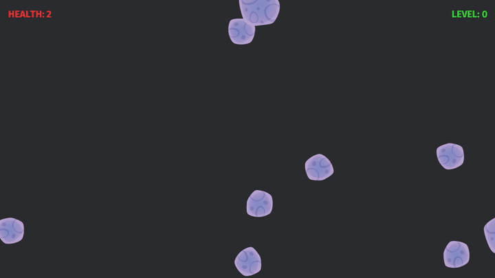
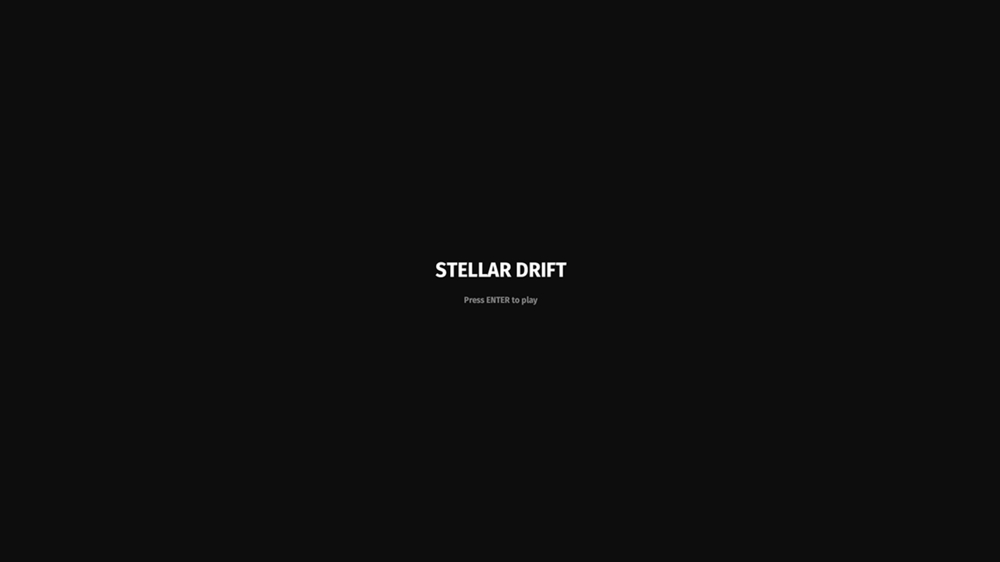
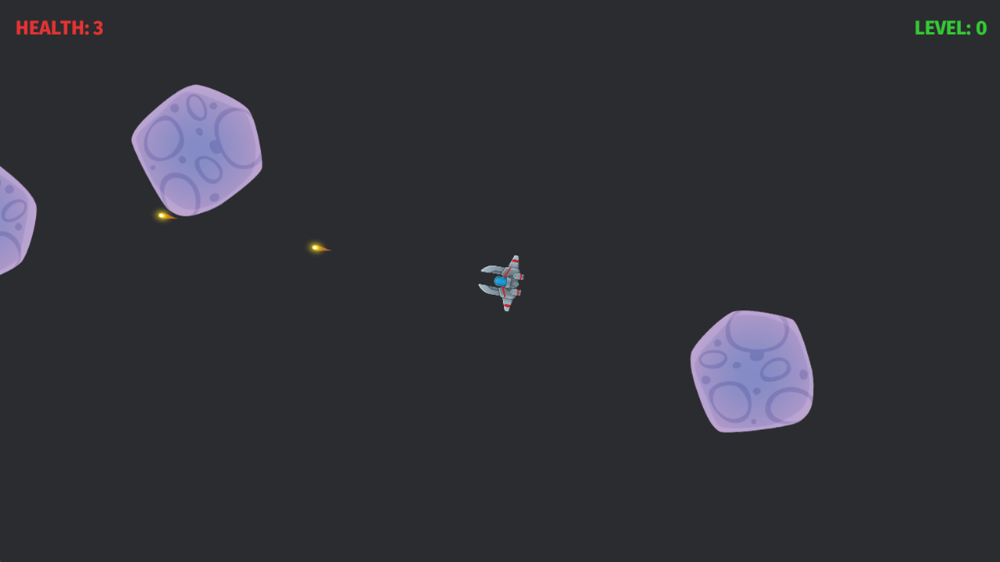
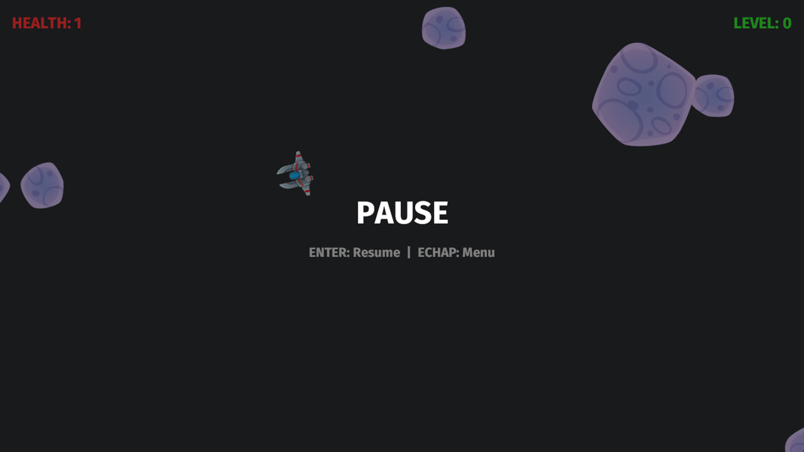
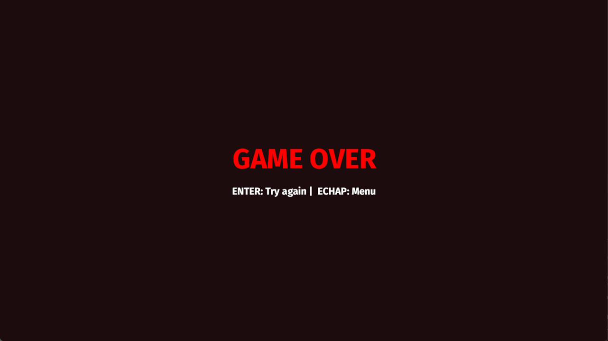

# Stellar Drift
Projet d'apprentissage en Rust + Bevy reprenant le jeu Asteroids d'Atari.

## Statut

Il s'agit de mon premier projet développé entièrement en Rust sous Bevy.

Jouable sur navigateur dès maintenant - [sur ma page itch.io](https://ficelo.itch.io/stellar-drift)

## Description du projet
Ce projet est à but éducatif.

J'y explore la conception de jeux indépendants. Stellar Drift est volontairement minimaliste afin de me concentrer sur l'entraînement de la stack technique.

Il me permet aussi d'apprendre l'**ECS**, *Entity Component System*, ainsi que de me familiariser avec **Bevy**, un moteur développé en Rust.

J'y intègre des notions clés, afin de saisir en profondeur les étapes de développement d'un jeu, comme :
- Un système de rendu physique, avec Rapier2D.
- Une gestion des états de jeu (Menu, Pause, Jeu).
- Une intégration audio 

## Stack technique
- **Langage** : Rust (édition 2021).
- **Moteur** : Bevy 0.12.1 (contrainte lié à l'environnement de développement)
- **Architecture** : ECS (Entity Component System).
- **Plateforme cible** : compilable sous Linux / exécutable sous Windows (via le dossier release).

## Lancer le projet
Prérequis :
- Rust installé ([rustup.rs](https://rustup.rs))

### Version native (Linux / desktop)
git clone https://github.com/ficeloo/stellar_drift.git
cd stellar_drift
cargo run --release
> Le mode release produit un binaire optimisé : la compilation est plus longue,
> mais le jeu tourne de façon fluide.

### Version web (en local)
Prérequis : trunk (`cargo install trunk`) + la cible wasm
(`rustup target add wasm32-unknown-unknown`)
trunk serve   # puis ouvrir l'URL locale affichée

### Sous Windows
1. Téléchargez la dernière version de la build dans la section [Releases](https://github.com/ficeloo/stellar_drift/releases) (actuellement v1.0).
2. Téléchargez également le dossier `assets/` correspondant.
3. Placez l'exécutable et le dossier `assets/` dans un même répertoire.
4. Lancez l'exécutable.

## Screenshots

## Ressources
### Assets
- Made by anim86, fetch from his Itch.io [profile page](https://anim86.itch.io/)
